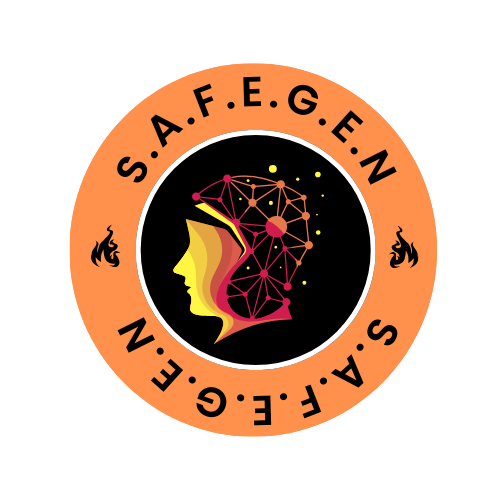
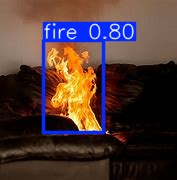
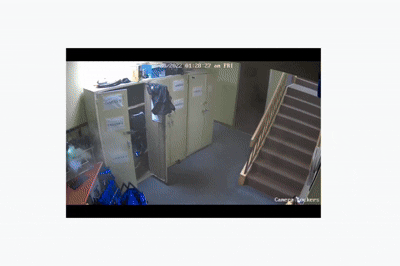

# 🔥 Project-S.A.F.E.G.E.N: Smart Automated Fire Emergency Guardian with Enhanced Notification

## 📖 Overview

**Project-S.A.F.E.G.E.N** (Smart Automated Fire Emergency Guardian with Enhanced Notification) is an autonomous fire detection system designed to identify fires in real-time and send instant notifications. Built with **Python**, **Ultralytics YOLOv8**, **SMTP**, and **Twilio**, it leverages advanced computer vision and communication technologies to enhance fire safety. The model is trained on a fire detection dataset from **Roboflow Universe** on Google Colab Notebook Using T4 GPU.

## ✨ Features

- 🚨 **Real-Time Fire Detection**: Uses YOLOv8 for fast and accurate fire detection.
- 📩 **Enhanced Notifications**: Sends alerts via email (SMTP) and SMS (Twilio).
- 🤖 **Autonomous Operation**: Fully automated with minimal human intervention.
- 🔧 **Scalable & Modular**: Easily integrates with other safety systems.

## 🛠️ Technologies Used

- 🐍 **Python**: Core programming language.
- 📸 **Ultralytics YOLOv8**: State-of-the-art object detection for fire identification.
- 📧 **SMTP**: Email notification system.
- 📱 **Twilio**: SMS-based alerts.
- 📊 **Roboflow Universe**: Source of the fire detection dataset.

## 📂 Dataset

The fire detection model is trained on a dataset from [Roboflow Universe](https://universe.roboflow.com/). It includes labeled images of fire and non-fire scenarios for robust YOLOv8 training.

## 🖼️ Demo

### 📷 Demo Photo

*Example of fire detection with YOLOv8 bounding boxes.*

### 🎥 Demo GIF

*Real-time fire detection and notification in action.*

## 📓 Model Training Notebook

A Jupyter Notebook is included to guide you through training the YOLOv8 model for fire detection.

- **Notebook**: [SAFEGEN_Model_Training.ipynb](SAFEGEN_Model_Training.ipynb)
